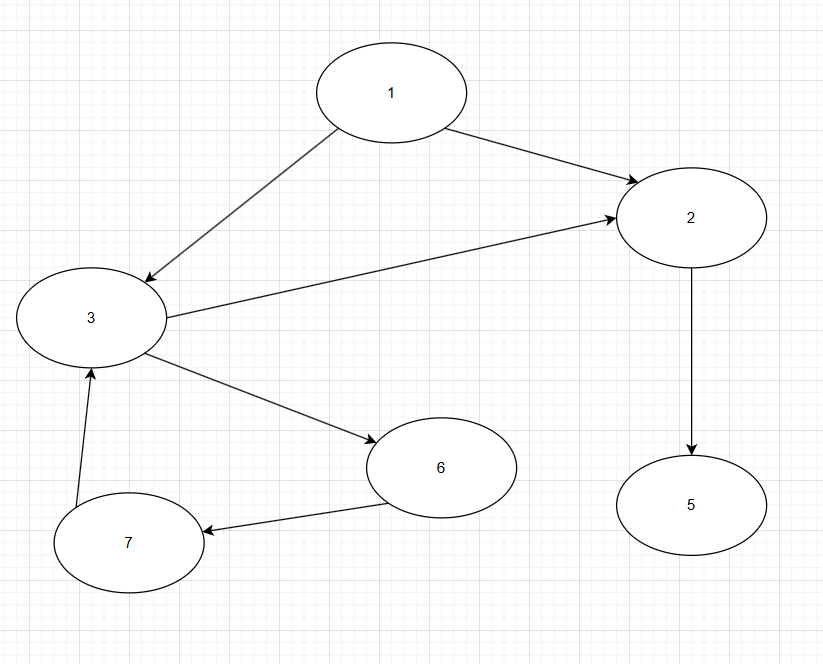

# TODO LIST API

- Plan: https://docs.google.com/document/d/1HzEkPgcPmaZr2aXNdBmNr2lR0lxgDbRHEJrFaxJjstc/edit?usp=sharing

- Documents folder: database and postman collection

## SUMMARY

- [1. What is this project used for?](#1-what-is-this-project-used-for)
- [2. What does this project can do?](#2-what-does-this-project-can-do)
- [3. 🚀 What technologies does this project use?](#3-what-technologies-does-this-project-use)
- [4. What is circular dependency?](#4-what-is-circular-dependency)
  - [4.1. Definition](#41-definition)
  - [4.2. How to detect it](#42-how-to-detect-it)
- [5. How to run this project?](#5-how-to-run-this-project)
  - [5.1. First method: with docker](#51-first-method-with-docker)
  - [5.2. Second method: without docker](#52-second-method-without-docker)

## 1. What is this project used for?

This project is a simple API for managing todo list.

## 2. What does this project can do?

- Create a new task
- Update a task
- Delete a task
- Get all tasks
- Get a task by id
- Get all parent tasks of a task
- Create / Delete a reference between tasks
- Detect a circular dependency in tasks
- Prevent circular dependency when adding new reference
- Periodically check tasks that are about to expire and send email notifications 

## 3. 🚀 What technologies does this project use?

- NodeJS
- ExpressJS
- MySQL
- Redis
- Nodemailer
- JWT
- Docker

## 4. What is circular dependency?

### 4.1. Definition

- Firstly, you can see the image below describe how task reference each other
- Each task can have multiple parent tasks and multiple child tasks

- <code>Circular dependency</code> problem occurs when <code>Task 3</code> depends on <code>Task 6</code> and <code>Task 6</code> depends on <code>Task 7</code> and <code>Task 7</code> depends on <code>Task 3</code> and... We have now got a circular dependency.😒😒



### 4.2. How to detect it

- Look at the image, we can see that like a graph, where each Node depends on other Nodes.
- So, how to detect it? The idea is when a Node is seen, but it is not resolved yet, we can say that we have a circular dependency.
- For example, we have a graph with path: **3 -> 6 -> 7 -> 3**
- Task 3 in the end of path is seen at the top, but it is not resolved yet, because of Task 3 depends on Task 6 and so on.

**This is how we can detect it by Pseudocode**

```bash
function dep_resolve(node, visited, unFinished) {

  unFinished.push(node);

  for parentNode in node.parents {

    if parentNode not in visited {
      if parentNode in unFinished {

        // we detected circular dependency here
      }
      dep_resolve(parentNode, visited, unFinished);
    }
  }
  visited.push(node);
  unFinished.remove(node);
}

// call function

type Node = {
  id: number,
  parents: Node[]
}

let firstNode : Node = {
  id: ...,
  parents: [ ... ]
}

dep_resolve(firstNode, [], []);
```

## 5. How to run this project?

### 5.1. First method: with docker

- Clone this project
- Create <code>.env</code> file in the root directory with following format

```bash
  APP_PORT= 8000

  DB_HOST= localhost                     (OPTIONAL)
  DB_PORT= 3306                          (OPTIONAL)
  DB_USER= root                          (OPTIONAL)
  DB_PASS= password                      (OPTIONAL)
  DB_NAME= tododb                        (OPTIONAL)

  REDIS_HOST= localhost                  (OPTIONAL)
  REDIS_PORT= 5678                       (OPTIONAL)
  REDIS_PASSWORD= password               (OPTIONAL)

  JWT_SECRET_KEY=secret
  ACCESS_TOKEN_EXPIRES_IN=1d

  EMAIL_USER = your@gmail.com            (OPTIONAL)
  EMAIL_PASS = 'umtj jklmn mvtg wrnz'    (OPTIONAL)
  EMAIL_HOST = gmail                     (OPTIONAL)
```

- Run the following command:

```bash
  docker-compose up --build
```

### 5.2. Second method: without docker

- Clone this project
- Create <code>.env</code> file in the root directory with following format

```bash
  APP_PORT= 8000

  DB_HOST= localhost
  DB_PORT= 3306
  DB_USER= root
  DB_PASS= password
  DB_NAME= tododb

  REDIS_HOST= localhost
  REDIS_PORT= 5678
  REDIS_PASSWORD= password

  JWT_SECRET_KEY=secret
  ACCESS_TOKEN_EXPIRES_IN=1d

  EMAIL_USER = your@gmail.com
  EMAIL_PASS = 'umtj jklmn mvtg wrnz'
  EMAIL_HOST = gmail
```

- Run the following command:

Step 1: Install dependencies

```bash
  npm install
```

Step 2: Run project

Option 1:

```bash
  npm run dev    # for development
```

Option 2:

```bash
  npm run build  # for build
  npm run start  # for run bundle code
```

[✨ Made by NodeJS with ❤️](https://github.com/ngantrandev)
